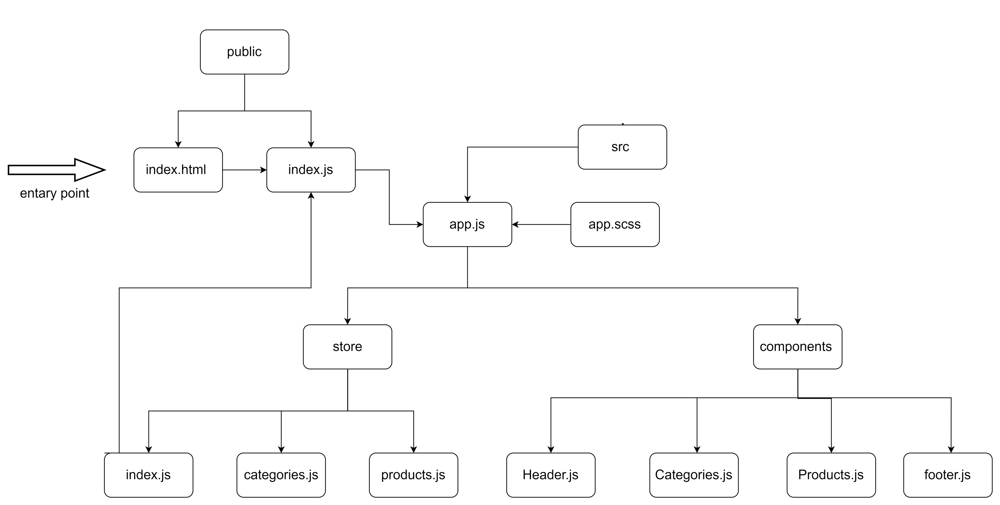

# Store Front

an application that will power an online storefront that will allow our users to browse our product offerings by category, place items in their shopping cart, and check-out when they are ready to make their purchase

### main features

- Display a list of our product categories
- Display a listing of products for each category, when the category is selected  
  From the product listings:
- Click to view a full detail page about the product
- Add the product to your shopping cart
- Shopping cart (simple version) always visible on screen
- Full shopping cart and check out screen available from main navigation

## lab 36

**_Phase 1_**: starting the process of creating an e-Commerce storefront using React with Redux, coupled with your live API server

- Application Setup
- Basic React Application
- Redux State Management
- State managed in memory
- Material UI Components & Styling

[pull request]()   
[netlify]()

