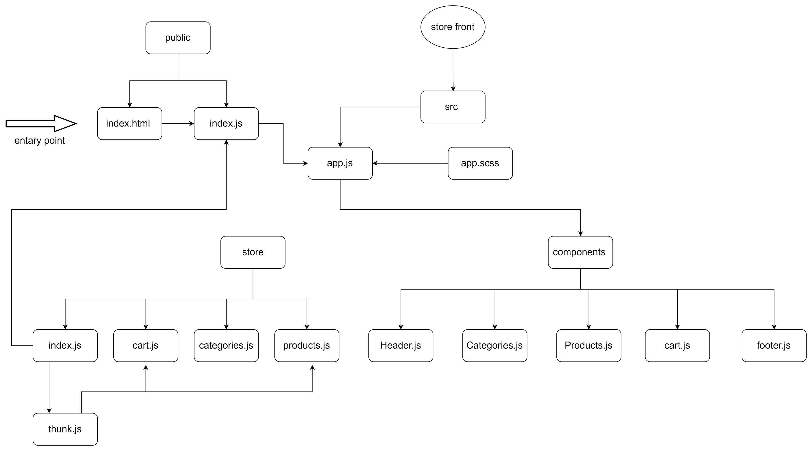

# Store Front

an application that will power an online storefront that will allow our users to browse our product offerings by category, place items in their shopping cart, and check-out when they are ready to make their purchase

**_Phase 1_**: starting the process of creating an e-Commerce storefront using React with Redux, coupled with your live API server

**_Phase 2_**: Continue work on the e-Commerce storefront, breaking up the store into multiple reducers and sharing functionality/data between components

**_Phase 3_**: Connect the Virtual Store to an API to retrieve live data from your data source, using thunk to enable asynchronous actions

[pull request](https://github.com/hibasalem/storefront/pull/3)  
[netlify](https://trusting-wescoff-5aae4c.netlify.app/)

### main features

- Display a list of our product categories
- Display a listing of products for each category, when the category is selected  
  From the product listings:
- Click to view a full detail page about the product
- Add the product to your shopping cart
- Shopping cart (simple version) always visible on screen
- Full shopping cart and check out screen available from main navigation
